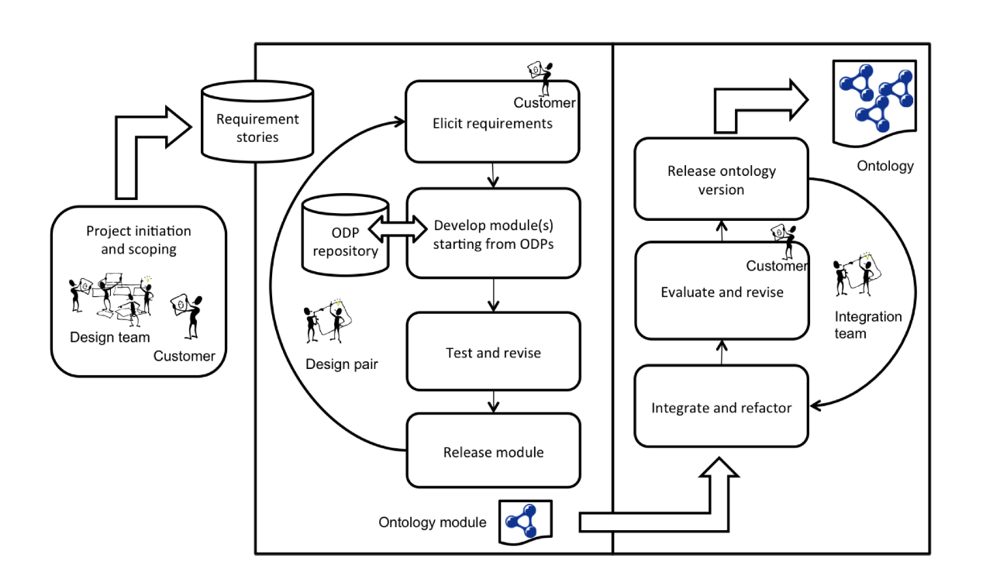

# Defense Supply Chain and Documentation Ontology (DSCDO)

Welcome to the Defense Supply Chain and Documentation Ontology (DSCDO) repository. DSCDO is designed to streamline and enhance the management of supply chain documentation in defense operations through the use of Knowledge Graphs (KGs), ontologies, and advanced AI technologies, particularly Large Language Models (LLMs).

## Introduction

### Why Use Knowledge Graphs for Supply Chain Information?

Knowledge Graphs offer a powerful method for structuring and visualizing complex supply chain data. By representing entities and their relationships in a graph format, KGs enable a comprehensive and interconnected view of supply chain networks. This structured approach facilitates better decision-making, improved traceability, and enhanced operational efficiency.

### The Role of Ontologies

Ontologies provide a formal framework for defining the types, properties, and relationships of entities within a domain. In DSCDO, ontologies standardize the representation of supply chain documentation, ensuring consistency and interoperability across different data sources. This standardization is crucial for creating systems that can effectively communicate and share data, thereby improving the robustness and reliability of supply chain management.

### Leveraging AI and LLMs with KGs and Ontologies

Integrating AI and LLMs with Knowledge Graphs and ontologies unlocks significant potential in supply chain analytics. AI-driven workflows can automate the extraction of knowledge from supply chain documents, creating structured triples that represent factual statements about the data. This process captures both the content and the provenance of the documents, ensuring transparency and accountability.

- **GraphRAG Integration**: GraphRAG (Graphs + Retrieval Augmented Generation) enhances the capabilities of LLMs by combining them with Knowledge Graphs. This integration allows for more precise and contextually relevant responses to complex queries, leveraging the structured data within KGs to provide comprehensive and accurate answers. Organizing extracted data into semantic clusters improves the efficiency of data retrieval and the quality of AI-generated insights [GraphRAG: Unlocking LLM discovery on narrative private data - Microsoft Research](https://www.microsoft.com/en-us/research/blog/graphrag-unlocking-llm-discovery-on-narrative-private-data/) [GraphRAG: Enhancing Traditional RAG through Knowledge Graph](https://www.pingcap.com/article/graphrag-enhancing-traditional-rag-through-knowledge-graph/).
  
- **Trustworthy Data**: Utilizing Decentralized Identifiers (DIDs), Verifiable Credentials (VCs), and distributed ledgers ensures the authenticity, integrity, and traceability of the data. These technologies provide a secure and verifiable framework for managing supply chain information, which is critical for maintaining trust and compliance in defense supply chain operations.

By integrating Knowledge Graphs, ontologies, and advanced AI technologies, DSCDO provides a robust and scalable framework for managing and analyzing defense supply chain documentation. This approach not only enhances data transparency and interoperability but also supports sophisticated AI-driven analytics, paving the way for more efficient and effective supply chain management.

For more information on how to get started, please refer to the [Installation](#installation) and [Usage](#usage) sections below.

## Development Methodology
**GitHub Integration:** The program leverages GitHub, a widely adopted platform for distributed version control and collaborative development. All ontology files and related documentation are hosted in a dedicated GitHub repository, enabling contributors to propose changes, review modifications, and merge accepted updates seamlessly.

**Pull Request Workflow:** Contributors can fork the main ontology repository, propose changes, and submit pull requests for review. This workflow ensures that all modifications undergo thorough peer review and approval before being merged into the main codebase, maintaining the ontologies' integrity and consistency.

**Semantic Versioning:** The ontology development process adheres to semantic versioning principles, where each version is assigned a unique identifier reflecting the level of change (major, minor, or patch). This practice facilitates clear communication of updates, compatibility tracking, and dependency management across the Knowledge Graph ecosystem.

**Modular Ontology Modeling:** Following the best practices outlined in ["Modular Ontology Modeling" by Cogan Shimizu et al.](https://www.semantic-web-journal.net/system/files/swj2886.pdf), the program adopts a modular approach to ontology development. This involves breaking down complex ontologies into smaller, reusable modules, promoting maintainability, extensibility, and collaborative development. The program embraces the principles of "extreme design" and the use of ontology design patterns, which provide proven solutions to common modeling challenges and promote consistency across the ontology modules. This workflow from requirements stories, though modular pattern-based design through ontology publication is illustrated in Fig 1 from  "Modular Ontology Modeling" included below.

Utilization of GitHub for Workflow Management and FAIR Data Principles Application:
- **Issue Tracking:** GitHub's issue tracking system is employed to manage the ontology development lifecycle, including feature requests, bug reports, and general discussions. This centralized approach ensures transparent communication and collaboration among stakeholders. The property `schema:source` is used to reference the source of the ontology term for example `schema:source <https://github.com/schemaorg/schemaorg/issues/2140>` is used to document the discussion around `3Dmodel` for inclusion in schema.org.
- **Project Boards:** Project boards within GitHub provide a visual representation of the ontology development workflow, allowing for the organization and prioritization of tasks, assignment of responsibilities, and tracking of progress.
- **FAIR Data Principles:** The program emphasizes adhering to the FAIR (Findable, Accessible, Interoperable, and Reusable) data principles throughout the ontology development process. To ensure optimal FAIR compliance, best practices from Daniel Garijo's lear licensing and provenance information. follows ["Best Practices for Implementing FAIR Vocabularies and Ontologies on the Web"](https://arxiv.org/abs/2003.13084v1) and FAIRsFAIR ["D2.5 FAIR Semantics Recommendations Second Iteration"](https://zenodo.org/record/4314321#.YW2XNtnMIeY) are followed. This includes the use of persistent and unique identifiers, rich metadata descriptions, open and standardized formats, and clear licensing and provenance information. 
- **Documentation Generation:** The program leverages [WIDOCO](https://github.com/dgarijo/Widoco), a widely adopted tool for generating comprehensive documentation from ontology files. WIDOCO can be integrated into the GitHub Actions workflow, ensuring that documentation is automatically generated and updated with each commit, promoting transparency and accessibility of ontological resources.
- **Ontology Annotation:** [WIDOCO Annotations](https://github.com/dgarijo/Widoco/blob/master/doc/metadataGuide/guide.md) provide a list of annotation vocabularies that are supported for direct html rendering into the ontology documentation to provide additional context and provenance information. The [Metadata Checklist](https://dgarijo.github.io/Widoco/doc/bestPractices/index-en.html) provides a list of best practices for metadata annotation in the ontology documentation. [OPLaX (Ontology Pattern Language eXtended) ontology](https://github.com/stlab-istc-cnr/OPLaX) provide an additional set of annotation properties that support modular ontology development through a design pattern approach.
- **Ontology Diagramming:** [Chowlk Visual Notation](https://chowlk.linkeddata.es/) and [templates for generating](https://github.com/oeg-upm/Chowlk) visual representations of ontologies are used to provide a graphical overview of the ontology structure, classes, and relationships. This visual representation enhances the understanding of the ontology's complexity and facilitates communication among stakeholders. The [diagrams.net](https://app.diagrams.net/) and  [VSCode](https://marketplace.visualstudio.com/items?itemName=hediet.vscode-drawio) Chowlk templates. 

## Expressivity

Ontology is modeled using [RDFS-Plus](http://mlwiki.org/index.php/RDFS-Plus) level of automatization with W3C [RDFS Schema](https://www.w3.org/TR/rdf-schema/) and selected W3C [OWL 2 Constructs](https://www.w3.org/TR/owl2-primer/). Additionally, to facilitate alignment and adoption using schema.org level base vocabularies as outlined in the schema.org [developer documentation](https://schema.org/docs/developers.html). This ontology is developed using [Modular Ontology Modeling Methodology](http://www.semantic-web-journal.net/content/modular-ontology-modeling-10) using [Ontology Design Patterns](http://ontologydesignpatterns.org/wiki/Main_Page) connected to form modules that build the larger ontology. Shape Constraints using [W3C Shapes Constraint Language](https://www.w3.org/TR/shacl/) are also provided for graph shape validation as discussed in the [SHACL and OWL](https://spinrdf.org/shacl-and-owl.html) document. Alignments are modeled similarly to the [RealEstateCore](https://github.com/RealEstateCore/rec) ontology that has created [modular alignments](https://github.com/RealEstateCore/rec/tree/master/ontology/alignments) that form the basis for adoption in [Azure Digital Twins](https://docs.microsoft.com/en-us/azure/digital-twins/concepts-ontologies) and cross linking to [Industry Standard Ontologies in a Knowledge Graph](https://docs.microsoft.com/en-us/azure/digital-twins/concepts-ontologies-adopt).

## Testing

The Defense Supply Chain and Documentation Ontology (DSCDO) employs a comprehensive testing methodology to ensure its robustness, accuracy, and compliance with standards. This methodology integrates continuous integration and deployment (CI/CD) practices to automate testing and validation processes. Our testing strategy focuses on several key areas:

1. **Ontology Merging**:
   - Ensures that individual ontology modules are correctly combined into a cohesive whole. This step verifies that all necessary components are integrated without conflicts.

2. **SHACL Validation**:
   - Utilizes SHACL (Shapes Constraint Language) to validate the merged ontology against predefined shapes. This ensures data integrity, consistency, and adherence to structural constraints.

3. **Competency Question Testing**:
   - Validates that the ontology can accurately answer competency questions derived from user stories. This step ensures that the ontology meets its intended use cases and provides meaningful responses.

4. **Documentation Generation**:
   - Generates comprehensive documentation for the ontology using Widoco. This ensures that all aspects of the ontology are well-documented and accessible to users.

### Continuous Integration and Deployment

To maintain the highest standards of quality and reliability, the testing processes are integrated into our CI/CD pipeline using GitHub Actions. This automation ensures that all tests are run on each commit and pull request, providing immediate feedback and maintaining the integrity of the ontology.

### Detailed Testing Processes

For detailed information about the testing scripts and their configurations, please refer to the README files in the respective subdirectories:

- **[Tests README](tests/README.md)**: Provides detailed instructions on the testing scripts and their configurations.
- **[Stories README](stories/README.md)**: Describes the structure for capturing user stories and competency questions.

## Persistent Identifiers and Namespace
The following URI structure is proposed for the prototype, similar to w3id.org redirect rule structure https://github.com/perma-id/w3id.org. Content negotiation will be used as part of the redirect rule to provide different serializations (JSON-LD, turtle, etc). It should be noted that this URI structure will likely need to be changed when deployed within a DoD network, and additional URI modeling may be required to capture additional functionality within the DoD networks. An example of this is the [“Adoption and Impact of an Identifier Policy – AstraZeneca”](https://fairtoolkit.pistoiaalliance.org/use-cases/adoption-and-impact-of-an-identifier-policy-astrazeneca/) which illustrates how AstraZeneca 
“…implemented a Uniform Resource Identifiers (URI) policy that describes how URIs need to be constructed to facilitate cross-enterprise Findability, Interoperability and Reuse of digital objects. Significant adoption benefits occur in information domains where one needs to utilize data across multiple sources and where one may not have control over information architecture within these sources. Focus areas taking advantage of this approach include clinical studies, translational medicine and competitive intelligence programs.”

Our minimum viable URI policy for the proposed system is as follows:
| URI Structure                                                    | URI Definition                                                                                   |
|------------------------------------------------------------------|--------------------------------------------------------------------------------------------------|
| https://schema.earth616.crc.nd.edu:8443/nd                                  | Root URI equivalent to w3id.org                                                                   |
| https://schema.earth616.crc.nd.edu:8443/nd{org}/                              | Organizational Root for example ND, SIMBA, etc.                                                   |
| https://schema.earth616.crc.nd.edu:8443/nd{org}/project/                      | Project Root                                                                                      |
| https://schema.earth616.crc.nd.edu:8443/nd{org}/{project}/ont/                  | Ontology URI Space                                                                                |
| https://schema.earth616.crc.nd.edu:8443/nd{org}/{project}/voc/                  | Vocabulary URI Space                                                                              |
| https://schema.earth616.crc.nd.edu:8443/nd{org}/{project}/shapes/               | Shapes Root URI Space to define shape documents used in the project                               |
| https://schema.earth616.crc.nd.edu:8443/nd{org}/{project}/shapes/shacl/         | Shapes Root URI for [SHACL](https://www.w3.org/TR/shacl/) encoded shapes                         |
| https://schema.earth616.crc.nd.edu:8443/nd{org}/{project}/shapes/shex/          | Shapes Root URI for [SHEX](https://shex.io/) encoded shapes (unused in this project but reserved) |

## Versions

The latest version of the full ontology can be found at hhttps://schema.earth616.crc.nd.edu:8443/nd/scdoc/ont/ and specific release versions can be found at hhttps://schema.earth616.crc.nd.edu:8443/nd/scdoc/ont/{version number} for example hhttps://schema.earth616.crc.nd.edu:8443/nd/scdoc/ont/0.1.0.

## Alignments

The Defense Supply Chain and Documentation Ontology (DSCDO) is designed to integrate seamlessly with various well-established standards and ontologies, ensuring interoperability, compliance, and efficiency. Below are the key alignments that DSCDO adheres to:

### GS1 EPCIS/CBV 2.0

The GS1 EPCIS (Electronic Product Code Information Services) and CBV (Core Business Vocabulary) 2.0 standards provide a comprehensive framework for capturing and sharing event-based information within supply chains. Aligning DSCDO with these standards is essential for enhancing the interoperability, traceability, and compliance of defense supply chain operations.

#### Enhancing Interoperability

The GS1 EPCIS/CBV standards are widely adopted across various industries for capturing and sharing supply chain events. By integrating these standards into DSCDO, we ensure seamless interoperability with other systems and organizations that also adhere to GS1 standards. This reduces friction in data exchange and facilitates efficient communication across different platforms and entities.

#### Standardizing Data Exchange

Adhering to GS1 EPCIS/CBV vocabularies ensures that data exchange formats within the defense supply chain are standardized, reliable, and easily interpretable by all stakeholders. This standardization minimizes errors and discrepancies, leading to more accurate and timely decision-making. It also supports the uniformity and consistency of data, which is crucial in the defense sector where precision is paramount.

#### Facilitating Global Compliance

Defense supply chains often operate across multiple countries and jurisdictions, each with its own regulatory requirements. The GS1 standards provide a globally recognized framework that helps ensure compliance with international regulations and best practices. By aligning DSCDO with these standards, we enhance the credibility and acceptance of our supply chain documentation on a global scale.

#### Improving Traceability and Accountability

The GS1 EPCIS/CBV standards are designed to enhance traceability and accountability within supply chains. Integrating these standards into DSCDO allows for detailed tracking and tracing of products, components, and transactions throughout the supply chain. This improved visibility aids in compliance, auditing, and security, enabling quick responses to issues such as recalls or quality control problems.

#### Leveraging Industry Best Practices

Aligning DSCDO with GS1 EPCIS/CBV vocabularies means leveraging best practices that have been refined and validated by leading organizations worldwide. This ensures that our ontology is built on a foundation of proven methodologies, enhancing its utility and reliability across diverse applications.

#### Future-Proofing the Supply Chain

As technology and industry standards evolve, the GS1 EPCIS/CBV standards continue to be updated to meet new challenges and opportunities. Aligning DSCDO with these standards positions our ontology to be future-proof, capable of adapting to new developments while maintaining relevance in a rapidly changing landscape.

Incorporating the GS1 EPCIS/CBV 2.0 vocabularies into DSCDO ensures that our defense supply chain operations are transparent, efficient, and compliant with global standards, enhancing overall effectiveness and reliability.

### Schema.org

Schema.org provides a collection of schemas for structured data on the Internet. By aligning with Schema.org, DSCDO ensures that supply chain data is compatible with widely used web standards, facilitating easier integration with web-based applications and improving data discoverability.

### Prov-O

The Provenance Ontology (Prov-O) supports the representation of provenance information. Aligning DSCDO with Prov-O ensures that the ontology can capture the provenance of supply chain data, enhancing transparency, accountability, and trust in the data.

### ProvOne Workflow

ProvOne extends the Provenance Ontology (Prov-O) to describe scientific workflows. Within the DSCDO project, ProvOne is essential for documenting the automated Knowledge Extraction (KE) and Knowledge Graph (KG) Construction workflows. 

#### Key Features for DSCDO

- **Detailed Process Documentation**: ProvOne provides a comprehensive framework for capturing the workflow steps, inputs, outputs, and dependencies, ensuring transparency and traceability in the KE and KG construction processes.
- **Enhanced Traceability**: By documenting every action and decision in the workflow, ProvOne enables rigorous auditing and verification, supporting the accuracy and trustworthiness of the extracted knowledge and constructed graphs.

### ML Commons Croissant

ML Commons Croissant is a standard for documenting machine learning datasets, ensuring comprehensive and consistent metadata. In the DSCDO project, it plays a vital role in the automated Knowledge Extraction (KE) and Knowledge Graph (KG) Construction workflows.

#### Key Features for DSCDO

- **Comprehensive Metadata**: ML Commons Croissant provides detailed metadata about datasets, including their provenance, structure, and preprocessing steps, crucial for understanding the context and quality of the extracted knowledge.
- **Dataset Traceability**: By documenting every aspect of the datasets used, ML Commons Croissant enhances traceability, making it easier to track the origin and transformations of data throughout the KE and KG workflows.

These alignments ensure robust documentation, traceability, and quality control in the automated KE and KG construction processes, enhancing the transparency and reliability of the DSCDO project.

### SPDX Version 3.0

SPDX version 3.0 is integral to documenting the automated Knowledge Extraction (KE) and Knowledge Graph (KG) Construction portions of the workflow within the Defense Supply Chain and Documentation Ontology (DSCDO) project. SPDX (Software Package Data Exchange) is an open standard for communicating software bill of materials (SBOM) information, which includes details about software components, dependencies, licenses, and vulnerabilities [SPDX 3.0 Revolutionizes Software Management in Systems with Enhanced Functionality and Streamlined Use Cases](https://www.linuxfoundation.org/press/spdx-3-revolutionizes-software-management-in-systems-with-enhanced-functionality-and-streamlined-use-cases) [SPDX 3.0 Is Released - FOSSA](https://fossa.com/blog/spdx-3-0/).

#### Documenting Knowledge Extraction and KG Construction

Within the DSCDO project, SPDX 3.0 is employed to meticulously document the automated processes involved in KE and KG construction. These processes use DSCDO modules and patterns to generate structured and interconnected data representations. SPDX helps capture and convey critical information about these software components and their interactions, enhancing transparency, traceability, and compliance.

1. **Automated Knowledge Extraction**:
   - SPDX is used to document the origins and dependencies of software tools and components used in KE. This ensures that every step in the extraction process is transparent and traceable.
   - By recording detailed SBOMs, SPDX enables the tracking of software versions, patches, and updates, crucial for maintaining the accuracy and reliability of extracted knowledge.

2. **Knowledge Graph Construction**:
   - SPDX profiles help document the tools and libraries used in the automated construction of KGs, ensuring all components are properly tracked and their relationships are well-defined.
   - The standard's capability to manage complex dependency and relationship data supports the dynamic integration of new data sources and updates, maintaining the integrity of the KG over time.

#### Key Features of SPDX 3.0 for DSCDO

- **Enhanced Documentation**: SPDX 3.0 introduces profiles that allow for more detailed and specific documentation of software components, including security, licensing, AI, and dataset profiles [oai_citation:3,SPDX 3.0 Is Released - FOSSA](https://fossa.com/blog/spdx-3-0/). This granularity is essential for accurately documenting the components involved in KE and KG construction.
- **Improved Vulnerability Management**: The security profile in SPDX 3.0 facilitates the tracking of vulnerabilities, enabling the project to manage risks associated with the software tools used in KE and KG processes [Capturing Software Vulnerability Data in SPDX 3.0 – SPDX](https://spdx.dev/capturing-software-vulnerability-data-in-spdx-3-0/).
- **Dynamic Relationship Management**: By treating relationships as independent elements, SPDX 3.0 allows for the flexible and dynamic updating of dependencies and relationships between software components without needing to modify the original elements [SPDX 3.0 Is Released - FOSSA](https://fossa.com/blog/spdx-3-0/).

#### Benefits for the DSCDO Project

- **Transparency**: SPDX provides a clear and detailed record of all software components and their relationships, enhancing the transparency of the KE and KG construction processes.
- **Traceability**: With detailed SBOMs, every change and update in the software ecosystem is traceable, supporting rigorous auditing and compliance requirements.
- **Interoperability**: Adhering to SPDX standards ensures compatibility with other systems and organizations, facilitating smoother data integration and exchange.

By leveraging SPDX 3.0, the DSCDO project ensures robust documentation, improved security, and enhanced management of the software components that underpin the automated KE and KG construction workflows. This alignment not only supports project goals but also adheres to industry best practices for software transparency and security.

### GeoSPARQL Version 1.1

GeoSPARQL provides an [Open Geospatial Consortium (OGC)](https://docs.ogc.org/is/22-047r1/22-047r1.html) standard for representing and querying geospatial data on the Semantic Web. By aligning with GeoSPARQL 1.1, DSCDO can handle geospatial data effectively, supporting use cases that require location-based information and analysis.

### W3C OWL Time and OWL Time Temporal Aggregates

The W3C OWL Time ontology provides a vocabulary for expressing temporal concepts. Aligning DSCDO with OWL Time and OWL Time Temporal Aggregates ensures that the ontology can accurately represent and reason about temporal data, which is crucial for managing and analyzing time-sensitive supply chain events.

### Semantic Sensor Network Ontology (SOSA)

The Semantic Sensor Network Ontology (SOSA) provides a standard for describing sensors and their observations. By aligning DSCDO with SOSA, the ontology can integrate sensor data, enhancing the ability to monitor and analyze real-time conditions within the supply chain.

These alignments ensure that DSCDO is built on a foundation of proven standards and best practices, enhancing its utility, reliability, and interoperability across diverse systems and applications.

### Decentralized Identifiers (DIDs), Verifiable Credentials (VCs), and Trustworthy Data Ledgers

Decentralized Identifiers (DIDs), Verifiable Credentials (VCs), and distributed ledgers are critical components for establishing secure, trustworthy, and verifiable data within the Defense Supply Chain and Documentation Ontology (DSCDO). These technologies enhance the integrity and reliability of Knowledge Extraction (KE) and Knowledge Graph (KG) Construction processes by ensuring that all data and entities are secure, verifiable, and interoperable.

#### Key Features and Integration

**DIDs and VCs in KE and KG Construction:**

- **Decentralized Identifiers (DIDs)**: DIDs enable verifiable, self-sovereign digital identities without relying on a central authority. As part of the W3C DID specification, they provide a standardized format in JSON-LD, allowing entities to control their digital identities independently. This is crucial for maintaining security and privacy in KE and KG construction by ensuring only authorized entities access and manipulate sensitive data.

- **Verifiable Credentials (VCs)**: VCs are digital statements that assert various claims about an entity, which can be cryptographically verified. The W3C VC specification in JSON-LD standardizes these credentials, enabling the DSCDO to verify the authenticity and integrity of information used in KE and KG workflows. This ensures data reliability and enhances the flexibility of issuing and consuming credentials 

**Distributed Ledgers:**

- **Trustworthy Data Ledgers**: Distributed ledgers, such as blockchain, provide an immutable and transparent record of transactions and interactions. They ensure the integrity and auditability of data within the DSCDO, supporting the detailed provenance and traceability of information throughout the KE and KG processes.

#### Enhancing Interoperability and Compliance

- **Schema.org Integration**: By adhering to W3C standards, DSCDO ensures compatibility with Schema.org, enhancing data interoperability and discoverability across web-based platforms. This alignment facilitates seamless integration and data exchange within the DSCDO .

- **GS1 EPCIS/CBV 2.0**: Aligning with GS1 EPCIS/CBV standards ensures the DSCDO can integrate event-based supply chain information, improving transparency and efficiency in supply chain management. These standards provide a robust framework for capturing and sharing event-based information, ensuring compliance with global supply chain practices  .

#### Role in Knowledge Graphs

- **Entity Verification**: DIDs and VCs are used to verify the identities and credentials of entities within the Knowledge Graph, ensuring that all data is reliable and authenticated. This verification process is crucial for maintaining the accuracy and trustworthiness of the KG .

- **Provenance and Traceability**: Distributed ledgers provide a clear record of the provenance and transformations of data, enhancing the traceability of information within the KG. This capability supports compliance with regulatory requirements and facilitates rigorous auditing.

For more detailed information on DIDs and VCs, refer to the [W3C DID specification](https://www.w3.org/TR/did-core/) and [W3C VC specification](https://www.w3.org/TR/vc-data-model/). For details on GS1 standards, visit the [GS1 website](https://www.gs1.org/standards/epcis).

## Contact

Please use this GitHub repository's [Issue tracker](https://github.com/crcresearch/earth616_ontology/issues) to request new terms/classes or report errors or specific concerns related to the ontology.

## Acknowledgements

---

## Direct Contact

**Charles Vardeman**  
_Research Assistant Professor_  
[Center for Research Computing](https://crc.nd.edu), [University of Notre Dame](https://nd.edu)  
<cvardema@nd.edu>  
Github: [charlesvardeman](https://github.com/charlesvardeman)  
ORCID: [0000-0003-4091-6059](https://orcid.org/0000-0003-4091-6059)