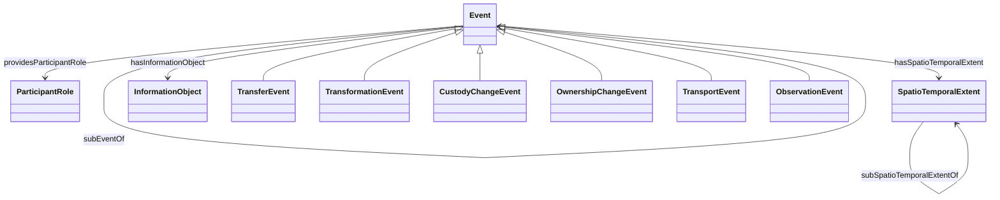

# Supply Chain Event Module

## General
* **Intent**: The Event module provides a structured model for representing various events within a supply chain context. It integrates spatial and temporal aspects, making it suitable for modeling events that involve movement or have discontinuous temporal extents. This module ensures that each event has at least one participant attached via a participant role and may include additional descriptive information through an information object.
* **Competency Questions**:
  - What events have occurred in the supply chain?
  - Who were the participants in a specific supply chain event?
  - When and where did a particular supply chain event take place?
* **Consequences**: 
  - This module can effectively model events that involve movement or have complex spatiotemporal characteristics.
  - It provides a clear structure for capturing the roles of participants in events.
  - This module does not address complex event relationships such as causality, provenance, or correlation.
* **Scenarios**:
  - A shipment transfer event from one warehouse to another.
  - A transformation event where raw materials are processed into finished goods.
  - An ownership change event when goods are sold from one party to another.

## Diagram in mermaidjs


## Elements
### Classes
* **Event** - Represents any kind of event within the supply chain. An event possesses a spatiotemporal extent, provides at least one participant role, which is performed by some entity (agents or otherwise), and may be a sub-event of another event. An event may also have additional descriptive information, which is consolidated through an information object.
* **ParticipantRole** - Represents a reified relationship between an event and one of its participants. Aligns with a separate Participant-Role pattern.
* **SpatioTemporalExtent** - Represents a unified spatial and temporal extent. Intended to cover non-static or discontinuous spatiotemporal extent. Aligns with a separate Spatiotemporal Extent pattern.
* **InformationObject** - Encapsulates all descriptive or non-defining information of the corresponding event, such as names, additional identifiers, and textual descriptions. Aligns with a separate Information Object pattern.
* **TransferEvent** - A type of event where goods are transferred from one location to another.
* **TransformationEvent** - A type of event where materials are transformed into different products.
* **CustodyChangeEvent** - A type of event where the custody of goods changes from one party to another.
* **OwnershipChangeEvent** - A type of event where the ownership of goods changes from one party to another.
* **TransportEvent** - A type of event where goods are transported from one place to another.
* **ObservationEvent** - A type of event where an observation or inspection is made.

### Properties
* **hasInformationObject** (Event, InformationObject) - Relates an event to its descriptive information object. Domain is not restricted to Event, but range is always InformationObject.
* **hasSpatioTemporalExtent** (Event, SpatioTemporalExtent) - Relates an event to its spatiotemporal extent. Domain is not restricted to Event, but range is always SpatioTemporalExtent.
* **providesParticipantRole** (Event, ParticipantRole) - Relates an event to a participant role. Domain is not restricted to Event, but range is always ParticipantRole.
* **subEventOf** (Event, Event) - Expresses partonomic (part-whole) relationships between two events. Domain and range are always Event.
* **subSpatioTemporalExtentOf** (SpatioTemporalExtent, SpatioTemporalExtent) - Indicates partonomic relationships between two spatiotemporal extents. The Event pattern only assumes that this is given by the spatiotemporal extent pattern used.

## Axioms in formal logic notation as a rule
```swrl
Event(?x) ^ providesParticipantRole(?x, ?p) ^ subEventOf(?x, ?y) -> providesParticipantRole(?y, ?p)
Event(?x) ^ hasSpatioTemporalExtent(?x, ?w) ^ subEventOf(?x, ?y) ^ Event(?y) ^ hasSpatioTemporalExtent(?y, ?z) -> subSpatioTemporalExtentOf(?w, ?z)
```

## Natural Language Description of Axioms
1. If an event (?x) provides a participant role (?p) and is a sub-event of another event (?y), then the super event (?y) also provides that participant role (?p).
2. If an event (?x) has a spatiotemporal extent (?w) and is a sub-event of another event (?y) which also has a spatiotemporal extent (?z), then the spatiotemporal extent (?w) of the sub-event (?x) is part of the spatiotemporal extent (?z) of the super event (?y).

## Related ODPs
* **SpatioTemporalExtent** - A pattern for representing spatial and temporal extents.
* **Participant-Role** - A pattern for modeling roles that participants play in events.
* **Information Object** - A pattern for representing additional descriptive information about events.

## Example
```turtle
@prefix : <http://example.org/supplychain#> .
@prefix xsd: <http://www.w3.org/2001/XMLSchema#> .

:ShipmentTransfer2024 a :TransferEvent ;
    :hasSpatioTemporalExtent [
        a :SpatioTemporalExtent ;
        :start "2024-05-01"^^xsd:date ;
        :end "2024-05-05"^^xsd:date ;
        :location "Warehouse A to Warehouse B"^^xsd:string
    ] ;
    :providesParticipantRole [
        a :ParticipantRole ;
        :role "Shipper"^^xsd:string ;
        :participant :LogisticsCompany
    ] ;
    :hasInformationObject [
        a :InformationObject ;
        :description "Transfer of electronics from Warehouse A to Warehouse B"^^xsd:string
    ] .
```

## References
* Adila Krisnadhi; Pascal Hitzler : A Core Pattern for Events. Under review at WOP 2016.
* [Event Core OWL](http://krisnadhi.github.io/onto/event.owl)
