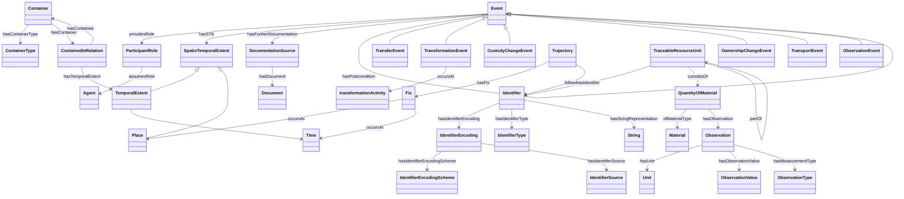

# Event Module

## General
* **Intent**: The Event module aims to model occurrences within a supply chain, capturing both spatial and temporal aspects, and involving multiple participants with specific roles. This module is particularly useful for representing events with complex spatiotemporal characteristics and multiple participants in supply chain scenarios.
* **Competency Questions**:
  - Where and when did a specific transfer event occur?
  - Who were the participants in a particular transformation event?
* **Consequences**: 
  - Enables the modeling of events with complex spatial and temporal characteristics.
  - Facilitates the tracking and documentation of various events within a supply chain.
* **Scenarios**:
  - A transfer event occurring at a specific location and time, involving the transfer of materials between two parties.
  - A transformation event where materials are processed or altered, with documentation and observation.

## Diagram in mermaidjs


## Elements
### Classes
* **Event** - Represents occurrences within the supply chain.
* **ParticipantRole** - Roles assigned to participants in an event.
* **SpatiotemporalExtent** - Combines spatial and temporal dimensions for events.
* **TemporalExtent** - Represents the temporal aspect of contained relations.
* **Place** - Specific locations related to events.
* **Time** - Specific times related to events.
* **Fix** - Specific spatiotemporal points.
* **Trajectory** - Paths that entities follow.
* **Identifier** - Unique identifiers for entities.
* **IdentifierEncoding** - Encoding schemes for identifiers.
* **IdentifierType** - Types of identifiers.
* **String** - String representations of identifiers.
* **TraceableResourceUnit (TRU)** - Units that can be traced within the supply chain.
* **QuantityOfMaterial** - Represents materials within a TRU.
* **Material** - The type of material within the quantity of material.
* **Observation** - Observations associated with measurements.
* **Unit** - Units used for measurement.
* **ObservationValue** - Values obtained from observations.
* **ObservationType** - Types of observations.
* **Container** - Physical or logical containers within the supply chain.
* **ContainerType** - Types of containers.
* **ContainedInRelation** - Relationships of containment.
* **DocumentationSource** - Documentation related to events.
* **Document** - Specific documents related to events.
* **TransformationEvent** - Events associated with transformation activities.
* **TransferEvent** - Events associated with transfers.
* **CustodyChangeEvent** - Events associated with changes in custody.
* **OwnershipChangeEvent** - Events associated with changes in ownership.
* **TransportEvent** - Events associated with transport.
* **ObservationEvent** - Events where observations are made.

### Properties
* **providesRole** (Event, ParticipantRole) - Links an event to its participant role(s).
* **hasSTE** (Event, SpatiotemporalExtent) - Links an event to its spatiotemporal extent.
* **hasFurtherDocumentation** (Event, DocumentationSource) - Links an event to its documentation source.
* **hasPrecondition** (Event, Event) - Pre-condition for an event.
* **hasPostcondition** (Event, Event) - Post-condition for an event.
* **assumesRole** (ParticipantRole, Agent) - The role assumed by an agent.
* **occursAt** (Fix, Place | Fix, Time) - The place or time an event occurs at.
* **hasFix** (Trajectory, Fix) - Links a trajectory to its fix points.
* **follows** (Trajectory, Identifier) - Sequential relationships between identifiers.
* **hasIdentifierEncoding** (Identifier, IdentifierEncoding) - Links an identifier to its encoding.
* **hasIdentifierType** (Identifier, IdentifierType) - Links an identifier to its type.
* **hasStringRepresentation** (Identifier, String) - Links an identifier to its string representation.
* **hasIdentifierEncodingScheme** (IdentifierEncoding, IdentifierEncodingScheme) - Links an identifier encoding to its scheme.
* **hasIdentifierSource** (IdentifierEncoding, IdentifierSource) - Links an identifier encoding to its source.
* **hasIdentifier** (TraceableResourceUnit, Identifier) - Links a TRU to its identifier.
* **consistsOf** (TraceableResourceUnit, QuantityOfMaterial) - Links a TRU to its material quantity.
* **partOf** (TraceableResourceUnit, TraceableResourceUnit) - Hierarchical relationship between TRUs.
* **ofMaterialType** (QuantityOfMaterial, Material) - Links a quantity of material to its type.
* **hasObservation** (QuantityOfMaterial, Observation) - Links a quantity of material to its observations.
* **hasUnit** (Observation, Unit) - Links an observation to its unit.
* **hasObservationValue** (Observation, ObservationValue) - Links an observation to its value.
* **hasMeasurementType** (Observation, ObservationType) - Links an observation to its type.
* **hasContainerType** (Container, ContainerType) - Links a container to its type.
* **hasContainer** (ContainedInRelation, Container) - Links a containment relation to its container.
* **hasContainee** (ContainedInRelation, Container) - Links a containment relation to its containee.
* **hasTemporalExtent** (ContainedInRelation, TemporalExtent) - Links a containment relation to its temporal extent.
* **hasDocument** (DocumentationSource, Document) - Links a documentation source to its document.
* **occursAt** (TransformationEvent, transformationActivity) - Links a transformation event to its activity.

## Axioms in first-order logic FOL as a rule
```
Event(?x) ^ providesRole(?x, ?p) ^ hasPrecondition(?x, ?y) -> providesRole(?y, ?p)
Event(?x) ^ hasSTE(?x, ?w) ^ hasPrecondition(?x, ?y) ^ Event(?y) ^ hasSTE(?y, ?z) -> hasSTE(?w, ?z)
```

## Natural Language Description of Axioms
1. If an event (?x) provides a participant role (?p) and has a pre-condition of another event (?y), then the pre-condition event (?y) also provides that participant role (?p).
2. If an event (?x) has a spatiotemporal extent (?w) and has a pre-condition of another event (?y) which also has a spatiotemporal extent (?z), then the spatiotemporal extent (?w) of the pre-condition event (?y) is part of the spatiotemporal extent (?z) of the event (?x).

## Related ODPs
* **SpatioTemporalExtent** - Represents spatial and temporal extents.
* **ParticipantRole** - Models roles that participants play in events.
* **InformationObject** - Represents additional descriptive information about events.

## Example
```turtle
@prefix : <http://example.org/event#> .
@prefix xsd: <http://www.w3.org/2001/XMLSchema#> .

:Event1 a :Event ;
    :hasSTE [ a :SpatioTemporalExtent ; :start "2024-05-30"^^xsd:date ; :end "2024-06-05"^^xsd:date ; :location "Location A"^^xsd:string ] ;
    :providesRole [ a :ParticipantRole ; :role "Transporter"^^xsd:string ; :participant :Agent1 ] ;
    :hasFurtherDocumentation [ a :DocumentationSource ; :hasDocument :Document1 ] .

:Event2 a :Event ;
    :hasSTE [ a :SpatioTemporalExtent ; :start "2024-06-06"^^xsd:date ; :end "2024-06-10"^^xsd:date ; :location "Location B"^^xsd:string ] ;
    :provides

Role [ a :ParticipantRole ; :role "Receiver"^^xsd:string ; :participant :Agent2 ] ;
    :hasPrecondition :Event1 ;
    :hasPostcondition :Event3 .

:Event3 a :Event ;
    :hasSTE [ a :SpatioTemporalExtent ; :start "2024-06-11"^^xsd:date ; :end "2024-06-15"^^xsd:date ; :location "Location C"^^xsd:string ] ;
    :providesRole [ a :ParticipantRole ; :role "Inspector"^^xsd:string ; :participant :Agent3 ] .
```

## References
- [A Core Pattern for Events](http://ontologydesignpatterns.org/wiki/images/5/52/WOP2016_paper_04.pdf) by Adila Krisnadhi and Pascal Hitzler
- [Participation](http://ontologydesignpatterns.org/wiki/Submissions:Participation)
- [Event Core OWL](http://krisnadhi.github.io/onto/event.owl)