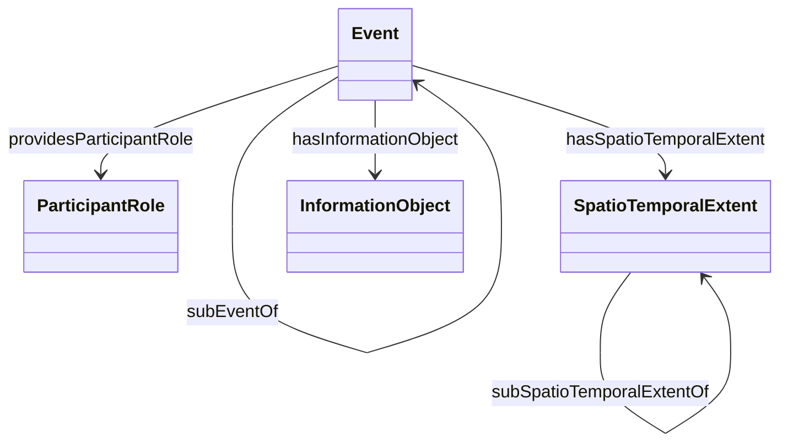

# EventCore

## General
* **Intent**: The purpose of this pattern is to provide a minimalistic model of events where it is not always possible to separate its spatial and temporal aspects. This pattern can model events that move or possess discontinuous temporal extents. Events according to this model have at least one participant, attached via a participant role, and may have additional descriptive information through an information object. Use this pattern when you need to model events that have complex spatiotemporal characteristics and involve multiple participants.
* **Competency Questions**:
  - Where and when did the 1990 World Chess Championship Match take place?
  - Who were involved in the 1990 World Chess Championship Match?
* **Consequences**: 
  - This pattern can model moving events and events with discontinuous temporal extents, provided an appropriate spatiotemporal extent model is used.
  - This pattern does not facilitate modeling complex relationships between events, such as causality, provenance, or correlation.
* **Scenarios**:
  - The 1990 World Chess Championship Match took place in New York from October 8 to November 7, 1990, and in Lyons, France, from November 26 to December 30, 1990.

## Diagram in mermaidjs


## Elements
### Classes
* **Event** - Represents any kind of event. An event possesses a spatiotemporal extent, provides at least one participant role, which is performed by some entity (agents or otherwise), and may be a sub-event of another event. An event may also have additional descriptive information, which is consolidated through an information object.
* **ParticipantRole** - Represents a reified relationship between an event and one of its participants. Aligns with a separate Participant-Role pattern.
* **SpatioTemporalExtent** - Hook to a complex notion representing a unified spatial and temporal extent. Intended to cover non-static or discontinuous spatiotemporal extent. Aligns with a separate Spatiotemporal Extent pattern.
* **InformationObject** - An entity that encapsulates all descriptive or non-defining information of the corresponding event, e.g., names, additional identifiers, textual descriptions, etc. Should normally be aligned to a separate Information Object pattern.

### Properties
* **hasInformationObject** (Event, InformationObject) - Relates an event to its descriptive information object. Domain is not restricted to Event, but range is always InformationObject.
* **hasSpatioTemporalExtent** (Event, SpatioTemporalExtent) - Relates an event to its spatiotemporal extent. Domain is not restricted to Event, but range is always SpatioTemporalExtent.
* **providesParticipantRole** (Event, ParticipantRole) - Relates an event to a participant role. Domain is not restricted to Event, but range is always ParticipantRole.
* **subEventOf** (Event, Event) - Expresses partonomic (part-whole) relationships between two events. Domain and range are always Event.
* **subSpatioTemporalExtentOf** (SpatioTemporalExtent, SpatioTemporalExtent) - Indicates partonomic relationships between two spatiotemporal extents. The Event pattern only assumes that this is given by the spatiotemporal extent pattern actually used.

## Axioms in formal logic notation as a rule
```swrl
Event(?x) ^ providesParticipantRole(?x, ?p) ^ subEventOf(?x, ?y) -> providesParticipantRole(?y, ?p)
Event(?x) ^ hasSpatioTemporalExtent(?x, ?w) ^ subEventOf(?x, ?y) ^ Event(?y) ^ hasSpatioTemporalExtent(?y, ?z) -> subSpatioTemporalExtentOf(?w, ?z)
```

## Natural Language Description of Axioms
1. If an event (?x) provides a participant role (?p) and is a sub-event of another event (?y), then the super event (?y) also provides that participant role (?p).
2. If an event (?x) has a spatiotemporal extent (?w) and is a sub-event of another event (?y) which also has a spatiotemporal extent (?z), then the spatiotemporal extent (?w) of the sub-event (?x) is part of the spatiotemporal extent (?z) of the super event (?y).


## Related ODPs
* **SpatioTemporalExtent** - A pattern for representing spatial and temporal extents.
* **Participant-Role** - A pattern for modeling roles that participants play in events.
* **Information Object** - A pattern for representing additional descriptive information about events.

## Example
```turtle
@prefix : <http://example.org/event#> .
@prefix xsd: <http://www.w3.org/2001/XMLSchema#> .

:ChessChampionship1990 a :Event ;
    :hasSpatioTemporalExtent [
        a :SpatioTemporalExtent ;
        :start "1990-10-08"^^xsd:date ;
        :end "1990-12-30"^^xsd:date ;
        :location "New York, USA; Lyons, France"^^xsd:string
    ] ;
    :providesParticipantRole [
        a :ParticipantRole ;
        :role "Competitor"^^xsd:string ;
        :participant :GarryKasparov
    ] ;
    :hasInformationObject [
        a :InformationObject ;
        :description "The 1990 World Chess Championship Match"^^xsd:string
    ] .
```

## References
* Adila Krisnadhi; Pascal Hitzler : A Core Pattern for Events. Under review at WOP 2016.
* [Event Core OWL](http://krisnadhi.github.io/onto/event.owl)